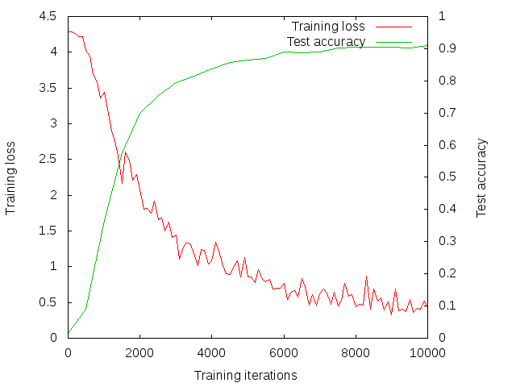
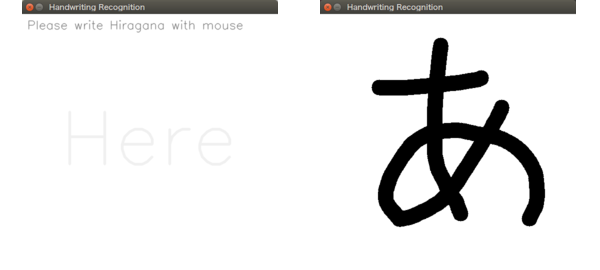
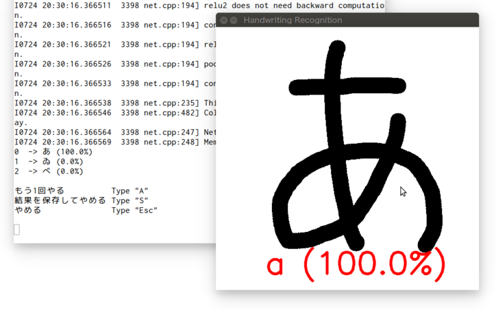

#Caffeで手書き文字（ひらがな）を認識する
* ひとつひとつ人が書いたデータセットをとなりの人にもらった
* [ayuge-sun](https://github.com/ayuge-sun)ありがと
* `clone`する場所は`caffe/examples`．

```bash
cd caffe/examples
git clone git@github.com:Ry0/handwriting_recognition.git
```

##Cifar10のモデルを使って学習
Dropoutを入れたり，イテレーション回数を増やしたりしてる．
詳細は同レポジトリ内の`.prototxt`参照．



###学習を行うときのメモ
手書きのデータセットはこのレポジトリにないので，関係者しか下のコマンドは意味無いです．

```bash
build/tools/caffe train --solver examples/handwriting_recognition/tegaki_cifar10_quick_solver.prototxt
```

※こちらで学習させて作成した`.caffemodel`はこのレポジトリにあるので，データセットがなくてもCaffeの環境が整っているならば下のプログラムは実行可能です．

##handwriting-recognition.pyの実行

```bash
cd handwriting_recognition/python
python handwriting-recognition.py
```

###スクリーンショット



